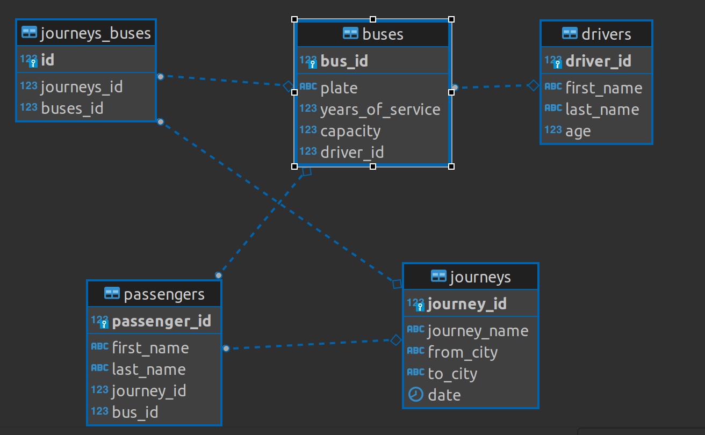

# Destacame Buses
Este proyecto fue realizado para poder registrar buses, trayectos, conductores y buses de una empresa 
transportes.

## Instalación
Hay 2 formas de ejecutar el proyecto, el primero con Docker y el segundo instalando dependencias.

## Modo 1: Con Docker
Se utiliza Docker para ejecutar el proyecto.
- Docker

### Guía de instalación
Para la instalación se asume que se ejecuta en un environment de Linux.
```bash
sudo docker-compose up --build
```

### Errores frecuentes
Para construir el contenedor de postgres, podría suceder que el puerto de la computadora 
host está utilizando el puerto 5432 (puerto default de postgres), lo que generaría un error al momento 
de ejecutar ``` bash sudo docker-compose up --build ```, por lo que se tendría que detener el proceso que use ese puerto.

```bash sudo lsof -i :5432 ```
 y obtenemos el process ID que utiliza el puerto 5432, y lo detenemos
```bash sudo kill <Process ID>```
y volvemos a ejecutar
```bash
sudo docker-compose up --build
```

Tambien podría pasar que el contenedor de la backend buildee más rápido que la base de datos, por lo que sería cuestión de 
intentar buildear de nuevo el proyecto con 
```bash
sudo docker-compose up --build
```
## Modo 2: Instalando dependencias
Son 3 los recursos que usan el proyecto: Base de datos en postgres, frontend y backend.
### Instalación Base de Datos
Crea una base datos en PostgreSQL
```bash
CREATE DATABASE buses_db;
```
### Instalación Frontend Node.js
```bash
cd frontend/
npm install
npm run serve
```
### Instalación Backend Django


- Crear environment de python de ser necesario
```bash
python -m venv myvenv
```
Ingresa a myvenv
```bash
cd myvenv/
```
Activa el entorno virtual
```bash
source bin/activate
```

Ingresa al repositorio (back)
```bash
cd backend/
```
Instala las dependencias
```bash
pip install -r requirements.txt
```

Editar el file settings.py para que se conecte a su base de datos local
```bash
DATABASES = {
    'default': {
        'ENGINE': 'django.db.backends.postgresql_psycopg2',
        'NAME': 'buses_db', 
        'USER':  'user',
        'PASSWORD': 'pass',
        'HOST': '127.0.0.1',
        'PORT': '5432',
    }
}
```
Ir a directorio
```bash
cd bus_management_backend/
```
Crear migraciones
```bash
python manage.py makemigrations
```
```bash
python manage.py migrate
```
Utilizar dump de datos 

```bash
python manage.py loaddata db.json
```

Corre el proyecto
```bash
python manage.py runserver
```
### Modelo de Datos
Diagrama ER


